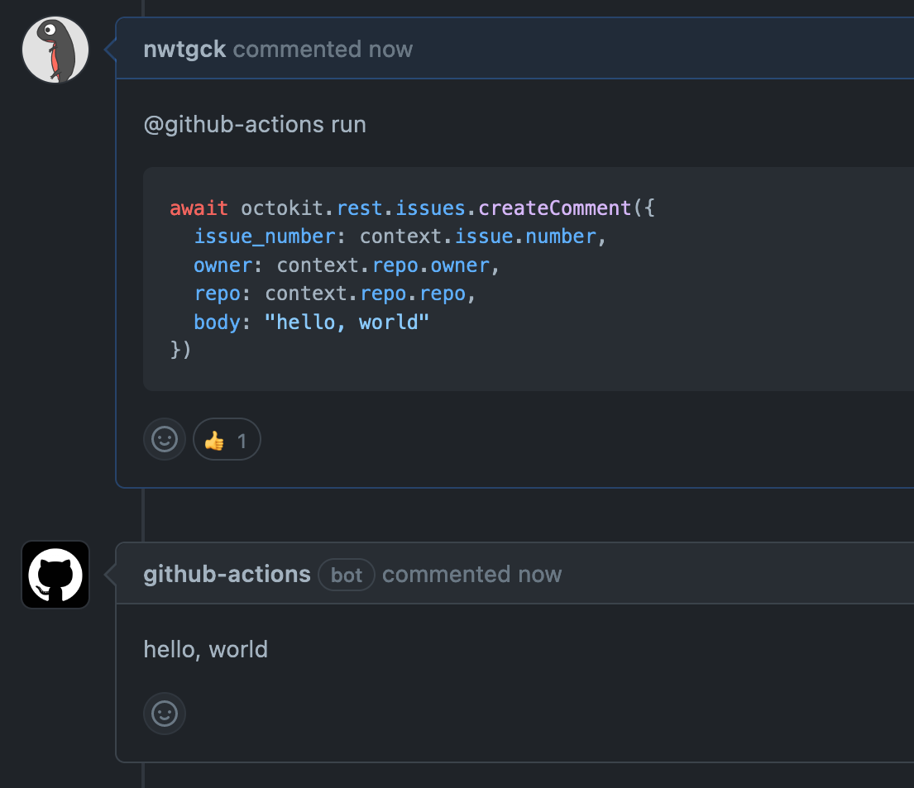

# actions-comment-run
Execute comment from issues and pull requests

## Say "hello, world"

You can make GitHub Actions Bot to say "hello, world".

Post comment below on your issue or pull request.



For shorter, you can use as follows.

````md
@github-actions run

```js
(async () => {
  await postComment("hello, world`");
})();
```
````

## Introduce this action
Put `.github/workflows/comment-run.yml` to introduce comment-run.

```yaml
# .github/workflows/comment-run.yml
name: "Comment run"
on:
  issue_comment:
    types: [created, edited]

jobs:
  comment-run:
    runs-on: ubuntu-18.04
    steps:
    - uses: actions/checkout@v2
      with:
        # 0 indicates all history
        fetch-depth: 0
    - uses: nwtgck/actions-comment-run@v1.0
      with:
        github-token: ${{ secrets.GITHUB_TOKEN }}
        allowed-associations: '["OWNER"]'
```

You can introduce comment-run with the following command.
```bash
mkdir -p .github/workflows/ && cd .github/workflows/ && wget https://gist.githubusercontent.com/nwtgck/a9b291f6869db42ecc3d9e30d0a0494c/raw/comment-run.yml
```
After introducing this, create new issue or pull request and post `@github-actions run` comment.

## Useful examples

### LGTM Image

Post random LGTM image with [LGTM.in/g](https://lgtm.in/).


````md
@github-actions run

<details>
<summary>LGTM 👍 </summary>

```js
(async () => {
  const res = await fetch("https://lgtm.in/g", {
    redirect: 'manual'
  });
  const webSiteUrl = res.headers.get('location');
  const picUrl = new URL(webSiteUrl);
  picUrl.pathname = picUrl.pathname.replace("/i/", "/p/");
  postComment(``);
})();
```
</details>
````


### Update all npm packages

Although Dependabot is useful, sometimes you might think bump all packages up. This comment allows you to do this.


````md
@github-actions run

```js
function exec(cmd) {
  console.log(execSync(cmd).toString());
}

// Config
const gitUserEmail = "github-actions[bot]@users.noreply.github.com";
const gitUserName = "github-actions[bot]";
const prBranchName = "comment-run/npm-update";

const baseBranchName = context.payload.repository.default_branch";
exec(`git config --global user.email "${gitUserEmail}"`);
exec(`git config --global user.name "${gitUserName}"`);
exec(`git fetch --all`);
exec(`git checkout ${baseBranchName}`);
exec(`git checkout -b ${prBranchName}`);

const packageJson = JSON.parse(require('fs').readFileSync('package.json'));
const depStr = Object.keys(packageJson.dependencies || {}).join(' ');
const devDepStr = Object.keys(packageJson.devDependencies || {}).join(' ');
exec(`npm i ${depStr} ${devDepStr}`);

exec("git status");
exec("git add package*json");
exec(`git commit -m 'chore(deps): update npm dependencies'`);
exec(`git push -fu origin ${prBranchName}`);

(async () => {
  await githubClient.pulls.create({
    base: baseBranchName,
    head: prBranchName,
    owner: context.repo.owner,
    repo: context.repo.repo,
    title: "chore(deps): update npm dependencies",
    body: "update npm dependencies",
  });
})();
```
````


### PR merge preview

GitHub Actions do not pass `secrets` to pull request from forked repositories. This security feature may restricts GitHub Actions usages. This comment is created to resolve the problem


````md
@github-actions run

<details>
<summary>🚀 Merge preview</summary>

```js
(async () => {
  // Get pull-req URL like "https://api.github.com/repos/nwtgck/actions-merge-preview/pulls/4"
  const pullReqUrl = context.payload.issue.pull_request.url;
  const githubUser = context.payload.repository.owner.login;
  const res = await fetch(pullReqUrl, {
    headers: [
      ['Authorization', `Basic ${Buffer.from(`${githubUser}:${githubToken}`).toString('base64')}`]
    ]
  });
  const resJson = await res.json();
  const prUserName = resJson.head.user.login;
  const baseBranchName = resJson.base.ref;
  const branchName = resJson.head.ref;
  const fullRepoName = resJson.head.repo.full_name;
  const previewBranchName = `actions-merge-preview/${prUserName}-${branchName}`;
  execSync(`git config --global user.email "github-actions[bot]@users.noreply.github.com"`);
  execSync(`git config --global user.name "github-actions[bot]"`);
  // (from: https://stackoverflow.com/a/23987039/2885946)
  execSync(`git fetch --all`);
  console.log(execSync(`git checkout ${baseBranchName}`).toString());
  console.log(execSync(`git checkout -b ${previewBranchName} ${baseBranchName}`).toString());
  console.log(execSync(`git pull https://github.com/${fullRepoName}.git ${branchName}`).toString());
  // Push preview branch
  // NOTE: Force push (should be safe because preview branch always start with "actions-merge-preview/")
  execSync(`git push -fu origin ${previewBranchName}`);
  const baseRepoFullName = context.payload.repository.full_name;
  // Create GitHub client
  const githubClient = new GitHub(githubToken);
  // Comment body
  const commentBody = `🚀 Preview branch:  \n<https://github.com/${baseRepoFullName}/tree/${previewBranchName}>`;
  // Comment the deploy URL
  await postComment(commentBody);
})();
```
</details>
````

### SSH in GitHub Actions over Piping Server

This comment allows you to go inside of GitHub Actions environment.


````md
@github-actions run

<details>
<summary>🌐 SSH debug over Piping Server</summary>

```js
(async () => {
  const pathLen = 64;
  const aPath = randomString(pathLen);
  const bPath = randomString(pathLen);

  console.log(execSync(`
chmod 755 "$HOME"
ls -lA /home
authorized_keys_file="$(sshd -T 2>/dev/null | grep -E '^authorizedkeysfile ' | cut -d ' ' -f 2)"
authorized_keys_file="$(cd && realpath -m "$authorized_keys_file")"
sshd_config_dir="$(dirname "$authorized_keys_file")"
(umask 0077 && mkdir "$sshd_config_dir")
echo $authorized_keys_file;

# (from: https://qiita.com/zackey2/items/429c77e5780ba8bc1bf9#authorized_keys%E3%81%AB%E8%A8%AD%E5%AE%9A%E3%81%99%E3%82%8B%E6%96%B9%E6%B3%95)
(echo; curl https://github.com/nwtgck.keys; echo) >> ~/.ssh/authorized_keys

sudo apt install -y socat;
`).toString());

    // Comment new session
    const commentBody = `\
## 🌐 New SSH session
Run the commands below in different terminals.

\`\`\`bash
socat TCP-LISTEN:31376 'EXEC:curl -NsS https\\://ppng.io/${bPath}!!EXEC:curl -NsST - https\\://ppng.io/${aPath}'
\`\`\`

\`\`\`bash
ssh-keygen -R '[localhost]:31376'
ssh -p 31376 runner@localhost
\`\`\`

`;
  await githubClient.issues.createComment({
    issue_number: context.issue.number,
    owner: context.repo.owner,
    repo: context.repo.repo,
    body: commentBody
  });

  execSync(`socat 'EXEC:curl -NsS https\\://ppng.io/${aPath}!!EXEC:curl -NsST - https\\://ppng.io/${bPath}' TCP:127.0.0.1:22`);
})();

// (from: https://stackoverflow.com/a/1349426/2885946)
function randomString(length) {
  let result           = '';
  const characters       = 'ABCDEFGHIJKLMNOPQRSTUVWXYZabcdefghijklmnopqrstuvwxyz0123456789';
  const charactersLength = characters.length;
  for ( var i = 0; i < length; i++ ) {
    result += characters.charAt(Math.floor(Math.random() * charactersLength));
  }
  return result;
}
```

## References
* <https://github.com/Cryolite/gha-sandbox/blob/789130f01504a372775be9a2fe4d8df6c4e0ce5c/.github/workflows/ssh.yaml>)
* <https://qiita.com/Cryolite/items/ed8fa237dd8eab54ef2f>

Thanks Cryolite!

</details>
````

## TIPS: Saved replies

"Saved replies" fits this action very much.  


You can save "Saved replies" as follows.  
Avatar icon > Settings > Saved replies


## TIPS: Run other languages

This action supports shebang (`#!`), so you can run shell and Python as follows.

````md
@github-actions run

```sh
#! /bin/sh
pip install numpy
```

```py
#! /usr/bin/python
import numpy as np

print(np.array([1, 2, 3]))
```
````

Here are examples.
- Deno: <https://github.com/nwtgck/actions-comment-run/pull/1#issuecomment-596170740>
- Go: <https://github.com/nwtgck/actions-comment-run/pull/1#issuecomment-596176678>
- Haskell: <https://github.com/nwtgck/actions-comment-run/pull/1#issuecomment-596176131>
- Scala: <https://github.com/nwtgck/actions-comment-run/pull/1#issuecomment-596180626>

## TIPS: Use existing package, TypeScript and mange on GitHub

When your comment-run scripts are matured, you might  want to use TypeScript for maintainability.
The following repository uses existing npm packages and TypeScript.  
<https://github.com/nwtgck/comment-run-scripts>


Built bundle .js files are hosted on GitHub Pages. So, your comment will be as follows.

````md
@github-actions run

```js
(async () => {
  const url = "https://nwtgck.github.io/comment-run-scripts/hello-world-comment.js";
  const js = await (await fetch(url)).text();
  eval(js);
})();
```
````
